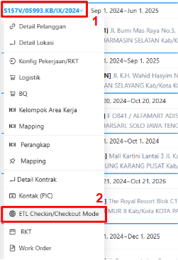
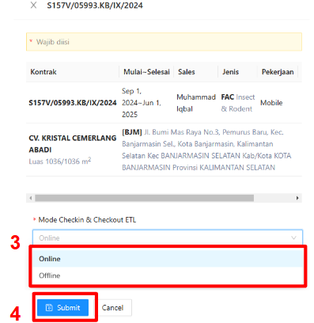

:::info
Secara default konfigurasi mode checkin/checkout ETL adalah Online, artinya operator membutuhkan koneksi internet ketika melakukan checkin dan checkout.

Namun, mode ini dapat diubah jika area kerja memiliki kendala jaringan atau kebutuhan khusus lainnya. Pengaturan ini dapat disesuaikan oleh pengguna melalui langkah berikut:
:::
1. Hover pada kontrak yang dipilih
2. Klik aksi `ETL Checkin/Checkout Mode`

    

3. Pilih Mode Checkin & Checkout
4. Klik `Submit`

