### Definisi
Aturan sebelumnya yang dicabut adalah:  
     Konfigurasi pelanggan untuk kerja di hari libur tidak berlaku lagi

Penyesuaian Sistem:
1. RKT akan menolak jika tanggal yang dipilih ada tanggal merah nasional
2. Penambahan jadwal RKB akan menolak jika tanggal yang dipilih ada tanggal merah nasional
3. Pemindahan jadwal dalam bulan yang sama, jika tanggal yang dipilih ada tanggal merah nasional maka akan ditolak

Jika harus bekerja pada tanggal merah nasional:
1. SPV membuat request bertingkat sampai COO
2. Jika disetujui COO, SPKO diterbitkan

|                     | Bulan Berjalan        | Bulan Selanjutnya   |
|---------------------|-----------------------|---------------------|
| Bukan Tanggal Merah | Tidak perlu approval  | Approval bertingkat |
| Tanggal Merah       | Perlu approval        | Approval bertingkat |

#### Approval
| Status   | Approval | Approval Bertingkat |
|----------|----------|---------------------|
| Draft    | SPV      | SPV                 |
| Confirm  | FC       | SPV                 |
| Approve  |          | FC                  |
| Validasi |          | FC                  |
| Close    | COO      | COO                 |

#### Menu
- <strong>Semua Jadwal</strong>, menampilkan semua jadwal pekerjaan berdasarkan status RKB (belum/sudah)
- <strong>Jadwal Tanggal Merah</strong>, menampilkan semua jadwal yang tertanggal pada tanggal merah
- <strong>Request Jadwal Tanggal Merah</strong>, menampilkan semua permintaan jadwal yang tertanggal pada tanggal merah dan perlu approval dari SPV/FC/COO
- <strong>Request Pindah Jadwal</strong>, menampilkan semua permintaan jadwal yang tertanggal pada tanggal merah maupun yang bukan tanggal merah

### Detail Jadwal
1. Arahkan kursor pada No. SPKO yang dipilih
2. Klik `Lihat Jadwal`  
   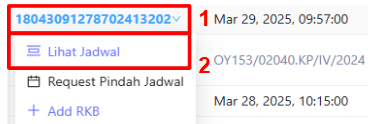
3. Maka akan tampil detail jadwal seperti gambar  
   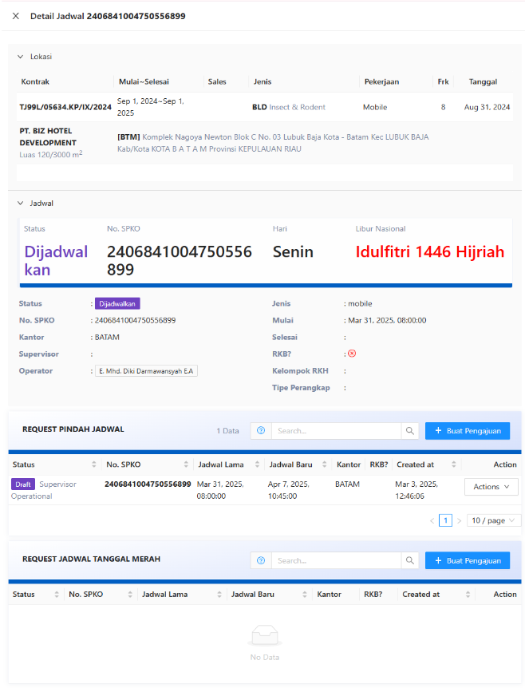
   
:::info
- Request Pindah Jadwal akan menampilkan semua jadwal terbaru berdasarkan permintaan pindah jadwal pada No. SPKO yang dipilih
- Request Jadwal Tanggal Merah akan menampilkan semua permintaan  jadwal baru yang terjadwal pada tanggal merah
:::

### Cari Semua Jadwal
1. Klik menu `Pekerjaan`
2. Klik `Semua Jadwal` atau akses
3. Ketik No. SPKO pada field search
4. Klik `🔍` 
   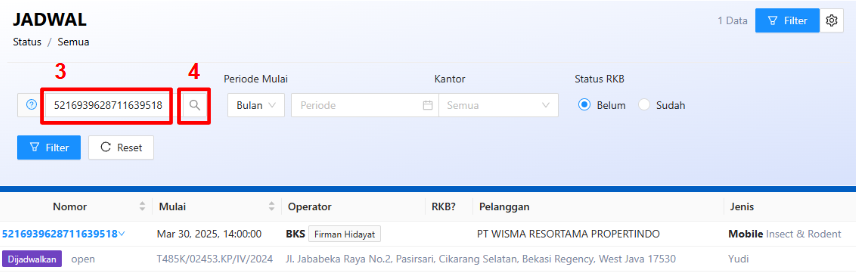

### Filter Semua Jadwal
:::info
- Status RKB harus dipilih Belum/Sudah
- Periode mulai bisa dipilih berdasarkan referensi tertentu, misalnya: berdasarkan tanggal, bulan, tahun, atau range tanggal tertentu
:::
1. Klik menu `Pekerjaan`
2. Klik `Semua Jadwal` atau akses
3. Pilih satu atau lebih pada setiap kategori
4. Klik `Filter` 
   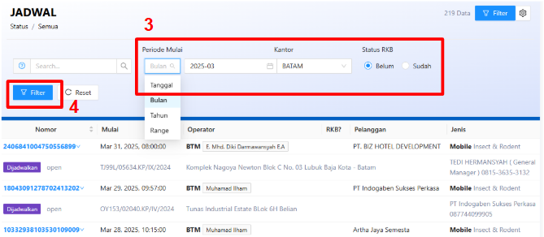

### Request Pindah Jadwal
1. Klik menu `Pekerjaan`
2. Klik `Semua Jadwal` atau akses  
   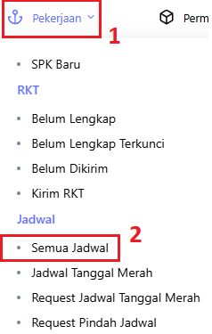 
3. Hover pada no. SPKO
4. Klik `Request Pindah Jadwal` 
   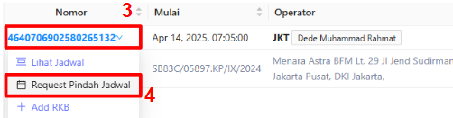 
5. Isi form 
   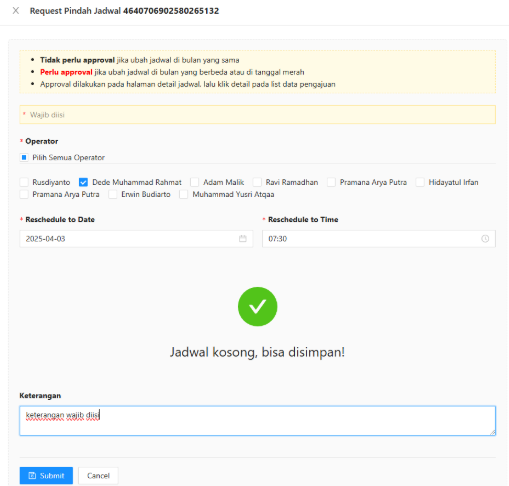 

### Request Jadwal Tanggal Merah
1. Klik menu `Pekerjaan`
2. Klik `Semua Jadwal` atau akses  
   
3. Hover pada no. SPKO
4. Klik `Request Jadwal Tanggal Merah` 
   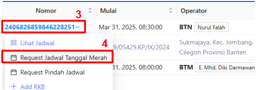 
5. Isi form 
    

### Approve Request Pindah Jadwal
1. Klik menu `Pekerjaan`
2. Klik `Semua Jadwal` atau akses  
   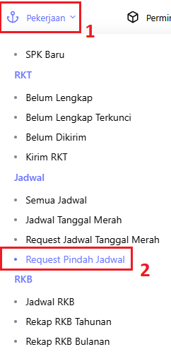
3. Cari nomor SPKO
4. Klik `Detail`  
   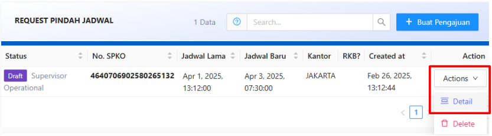
5. Klik `✔` untuk approve
6. Klik `✖` untuk reject  
   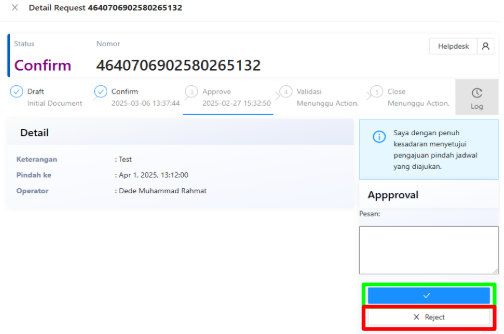

