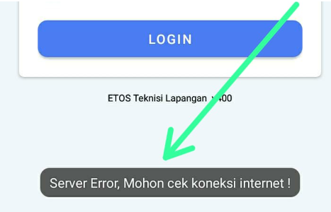

### Internal Server Error setiap saya ingin buat jadwal
  

Maaf atas kejadian ini! Apabila Anda menemukan notif `Internal Server Error` saat ingin buat jadwal bisa jadi penyebabnya adalah download yang tidak sempurna. Silahkan lakukan download ulang pada koneksi yang stabil

### Internal Server Error setiap saya ingin login

  
Checkin/Checkout secara default di-setting untuk dilakukan secara online. Apabila dibutuhkan checkin/checkout secara offline dapat SPV konfig pada ERP. Apabila anda menemukan notif `Server Error`, lakukan langkah-langkah berikut:
1. Pastikan Anda memiliki koneksi internet yang stabil
2. Pastikan menggunakan aplikasi versi terbaru yang di-install dari playstore.
3. Apabila masih menemukan masalah yang sama silahkan re-install aplikasi