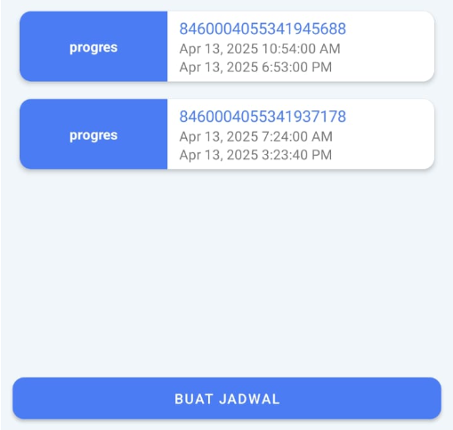

:::notes
**Buat Jadwal** harus dilakukan mode online dengan jaringan data/wifi yang stabil
:::

### Jadwal
1. Klik tombol `BUAT JADWAL` untuk membuat jadwal
2. Operator dapat checkin setelah membuat jadwal
3. Durasi jadwal sesuai dengan durasi pada kontrak
---