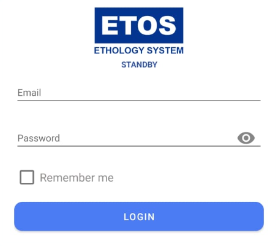

1. Buka aplikasi ETL Mobile di perangkat Android.
2. Masukkan `Email` dan `Password`

3. Tekan tombol `Login`
4. Setelah berhasil login, Anda akan diarahkan ke halaman utama aplikasi yang mungkin menampilkan daftar pekerjaan atau informasi lainnya

:::note
Bagi operator yang belum memiliki akun, silahkan koordinasi dengan SPV untuk minta didaftarkan ke bagian HR (Human Resources)
:::