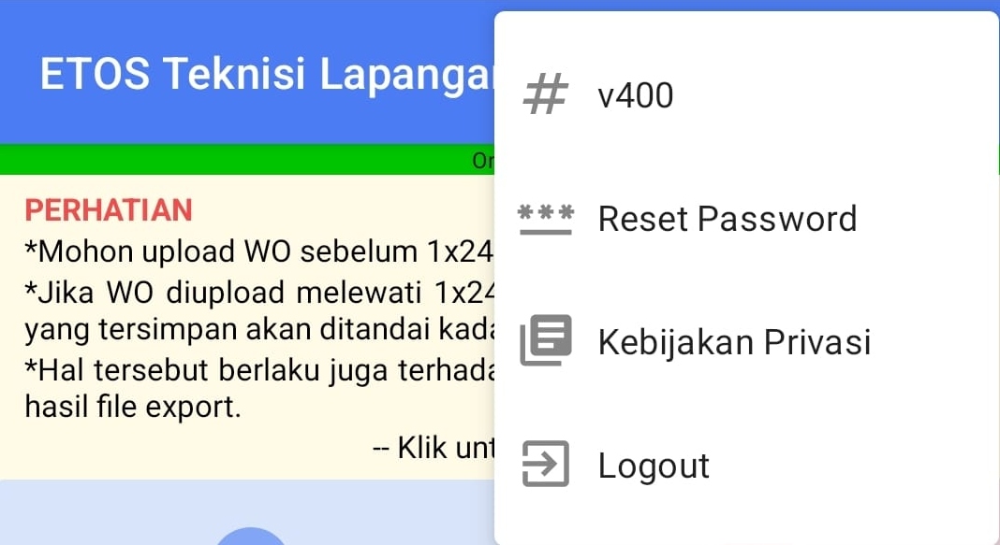

* `# v400`: Menampilkan informasi versi aplikasi, yaitu v400.
* `\*\*\* Reset Password`: Opsi untuk mengatur ulang kata sandi akun pengguna.
* `Kebijakan Privasi`: Mengarahkan pengguna ke halaman yang berisi informasi mengenai kebijakan privasi aplikasi. Ikon di sebelah kiri teks berupa gambar buku terbuka atau dokumen.
* `Logout`: Opsi untuk keluar dari akun pengguna saat ini. Ikon di sebelah kiri teks berupa panah mengarah ke kanan keluar dari sebuah kotak.

