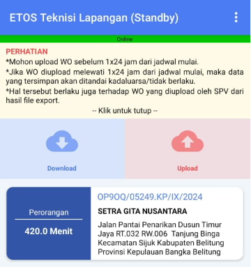
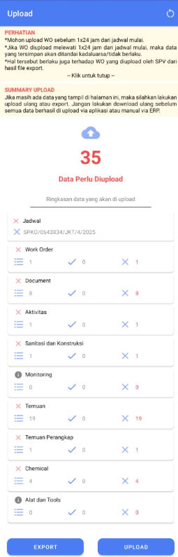
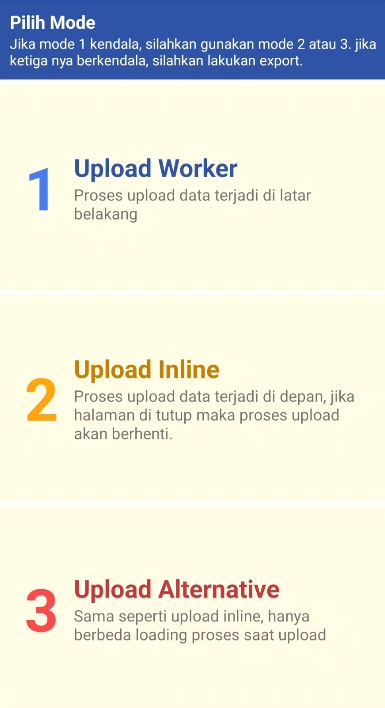
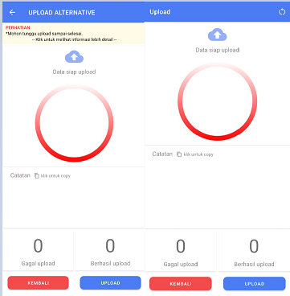
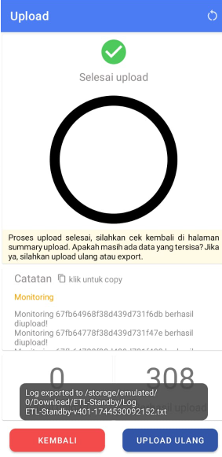
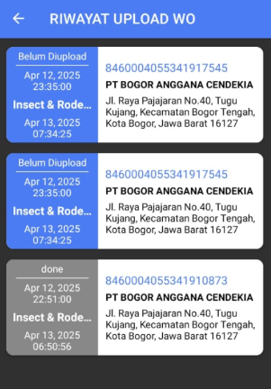

:::info
Setelah melakukan satu, beberapa atau semua pekerjaan (bisa multiple SPKO), operator perlu melakukan upload secara online dengan jaringan internet yang stabil. Operator tidak perlu upload saat berada di area.
:::

:::tip
* Mohon upload WO sebelum 1x24 jam dari jadwal mulai
* Jika WO diupload melewati 1x24 jam dari jadwal mulai, maka data yang tersimpan akan ditandai kadaluarsa/tidak berlaku
* Hal tersebut berlaku juga terhadap WO yang diupload oleh SPV dari hasil file export
* Jika mode 1 kendala, silahkan gunakan mode 2 atau 3. Jika ketiganya berkendala, silahkan lakukan export
:::

1. Klik `UPLOAD` pada halaman awal  
     
2. Klik `YA`
3. Tampil summary upload  
     
4. Klik `UPLOAD`
5. Klik `Upload Worker`.
6. Jika mode normal berkendala, silahkan pilih mode lainnya  
     
7. Selanjutnya, tampil halaman upload sesuai dengan modenya  
     
8. lik `UPLOAD`, tunggu hingga proses selesai
9. Upload berhasil, maka log otomatis terunduh  
     
10. Klik`UPLOAD ULANG` apabila ada data yang belum terupload, abaikan apabila semua data berhasil terupload.
12. Klik `KEMBALI`, kemudian akan tampil summary upload berhasil

:::warning
Jika masih ada data yang tampil di halaman ini, maka silahkan lakukan upload ulang atau export. Jangan lakukan download ulang sebelum semua data berhasil diupload via aplikasi atau manual via ERP
:::

### Log Upload
1. Log upload berisi informasi mengenai data pekerjaan yang berhasil diupload atau yang gagal diupload ke sistem
2. Log upload akan otomatis terunduh ketika semua data berhasil terupload
3. Log upload ada pada folder storage/Downloads/ETL-Standby/Log ETL Standby-v401-1744530092152.txt  
    

### Riwayat Upload
1. Klik titik tiga pada pojok kanan atas
2. Klik `Riwayat Upload WO`  
   