import Tabs from '@theme/Tabs';
import TabItem from '@theme/TabItem';

<Tabs groupId="wo" queryString>

<!-- Perangkap -->
<TabItem value="perangkap" label="Perangkap">
    :::info
    Input data pekerjaan untuk perangkap lebih baik realtime setelah melakukan tindakan dan bisa dilakukan secara offline
    :::

   ### Tindakan Perangkap
   1. Pilih area kerja (Misal: _Area Dalam – Counter_)
   2. Klik `PERANGKAP`   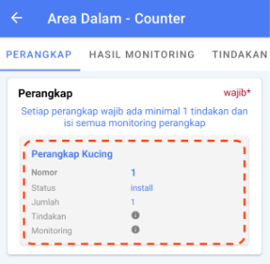 
   3. Klik `Tindakan Perangkap`   
   4. Pilih salah satu tindakan perangkap   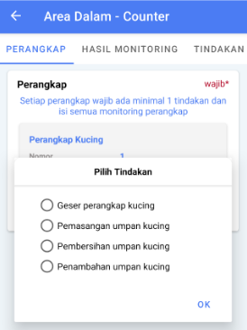
   5. Klik `OK`
   6. Maka akan ada tanda checklist pada tindakan dari perangkap   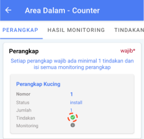
   

   ### Monitoring Perangkap
   1. Pilih area kerja (Misal: _Area Dalam – Counter_)
   2. Klik `PERANGKAP`   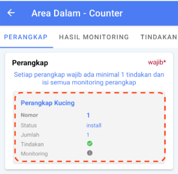 
   3. Klik `Monitoring Perangkap`   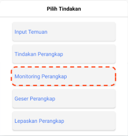
   4. Pilih jenis monitoring pada popup yang tampil   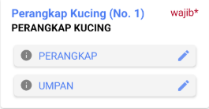
   5. Isi pilihan dan keterangan pada halaman monitoring    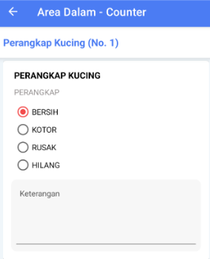
   6. Klik tombol `SIMPAN`
   7. Maka akan ada tanda checklist pada monitoring dari perangkap   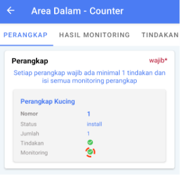

   ### Hilang Perangkap
   :::info
   Jika perangkap ditandai sebagai perangkap hilang maka :
   - Status perangkap berubah menjadi ”hilang”
   - Tindakan perangkap sudah terchecklist (walaupun tidak diisi)
   :::
   1. Pilih area kerja (Misal Area Dalam – Counter)
   2. Klik `PERANGKAP`
   3. Klik `Perangkap Hilang`  
      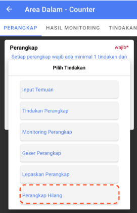
   4. Klik tombol `YA` pada dialog konfirmasi  
      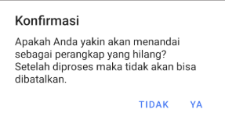
   5. Status perangkap berubah menjadi ”hilang† 
      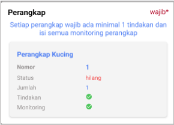

   ### Install Perangkap
   :::warning
   Pastikan stok perangkap atau chemical masih tersedia, jumlah pemasangan perangkap maksimal sesuai dengan stok yang ada.
   :::
   Contoh perangkap/chemical masih tersedia  
      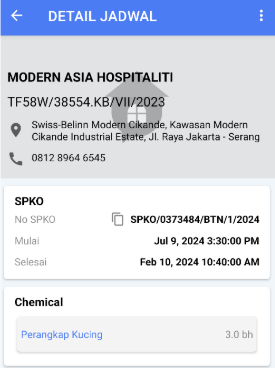

   1. Pilih area kerja (Misal: _Area Dalam – Office_)
   2. Pilih `TINDAKAN`
   3. Klik `TAMBAH TINDAKAN`
   4. Pilih Tindakan (Misal: _Pemasangan perangkap kucing_)  
      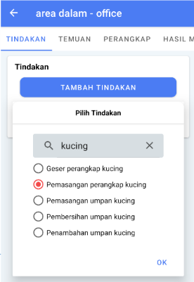
   5. `📷 Tambah Foto` maksimal 2 foto
   6. Isi Keterangan  
      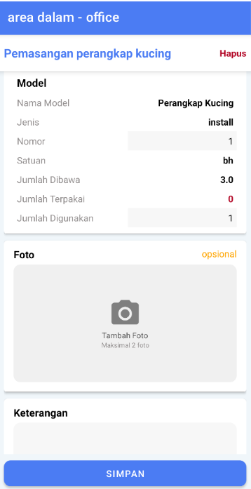
   7. Klik `SIMPAN`  
      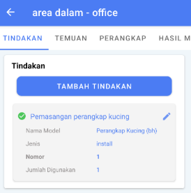

   ### Geser Perangkap
   :::info
   Mekanisme geser perangkap bukan pindah dari sub area A ke B. Tapi di sub area yang sama hanya pada titik koordinat yang berbeda.
      ❌ Contoh tidak valid   : Area Dalam - Kitchen => Area Dalam - Toilet
      ✅ Contoh valid         : Area Dalam - Kitchen => Area Dalam - Kitchen
   :::

   1. Klik nomor perangkap yang akan digeser
   2. Klik `Geser Perangkap`  
      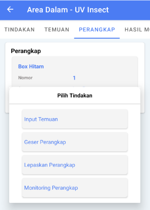
   3. Isi foto, keterangan dan koordinat pada halaman geser perangkap  
      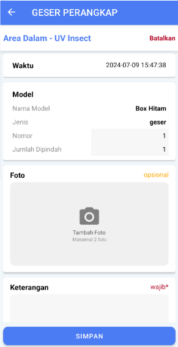
   4. Klik `SIMPAN`  
      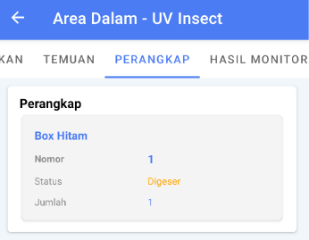

   ### Lepas Perangkap
   1. Klik nomor perangkap yang akan digeser
   2. Klik `Lepaskan Perangkap`  
      
   3. Isi foto, keterangan dan koordinat pada halaman geser perangkap  
      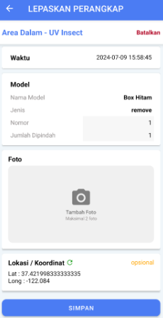
   4. Klik `SIMPAN`  
      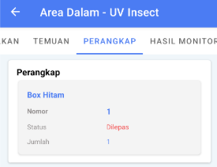
</TabItem>

  <!-- Hasil Monitoring -->
  <TabItem value="hasil-monitoring" label="Hasil Monitoring">
    Hasil Monitoring
  </TabItem>

  <!-- Tindakan -->
  <TabItem value="tindakan" label="Tindakan">
   :::info
   Input data pekerjaan untuk tindakan lebih baik realtime setelah melakukan tindakan dan bisa dilakukan secara offline.
   Pada section tindakan, masukkan tindakan atau treatment yang dilakukan di area tersebut
   :::

   1. Klik `TAMBAH TINDAKAN`    
   2. Pilih salah satu, klik `OK`   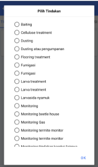
      Contoh yang dipilih Tindakan adalah Pemasangan EG, maka tampil Model alat Glue Trap Lem, disini Operator dapat mengisi nomor glue trap tersebut sebagai penanda sudah berapa glue trap yang terpasang di area tersebut 
   3. `📷 Tambah Foto`
   4. Isi Keterangan nya sesuai dengan Tindakan nya (Misal: _Pemasangan EG 1 pojok bawah_)
   5. Lokasi dan koordinat titik pemasangan trap nya. Apabila tidak muncul koordinat nya, bisa klik refresh di sebelah kanan tulisan Koordinat
   6. Klik `SIMPAN`   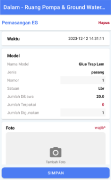
   
   :::warning
   - Harap pastikan setiap yang diisi itu sesuai dengan apa yang ada
   - Jika tidak tampil list tindakan & temuan, klik tanda (tombol) refresh yang muncul tersebut
   :::

  </TabItem>

  <!-- Temuan -->
  <TabItem value="temuan" label="Temuan">
   1. Klik`TEMUAN`
   2. Pilih hama  
   3. Klik `Input Temuan`  
      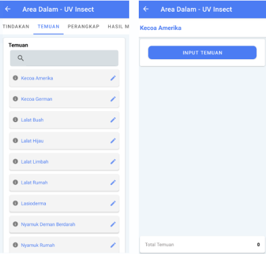
   4. Pilih temuan hama tersebut ditemukan pada perangkap atau tidak
      - Tidak menggunakan perangkap: input jumlah temuan
      - Menggunakan perangkap: pilih jenis perangkap nya dan input jumlah temuan  
      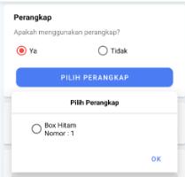
      
   5. `📷 Tambah Foto`
   6. Isi Keterangan
   7. Isi lokasi dan koordinat titik dari temuan
   8. Klik `SIMPAN`
  </TabItem>
  <TabItem value="foto-subarea" label="Foto Subarea">
   :::info
   Jika pada area ada tindakan monitoring maka wajib diisi. Namun, jika pada area tidak ada tindakan monitoring makan opsional untuk diisi
   :::
   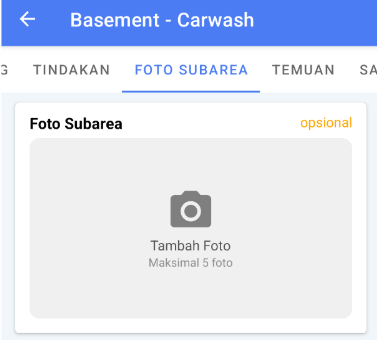  
   1. Klik `📷 Tambah Foto`
   2. Maksimal 5 foto
  </TabItem>
  <TabItem value="sanitasi" label="Sanitasi">
   :::info
   Jika ada tindakan area atau tindakan perangkap maka wajib diisi. Namun, jika tidak ada tindakan area atau tindakan perangkap maka opsional tidak diisi.
   :::
   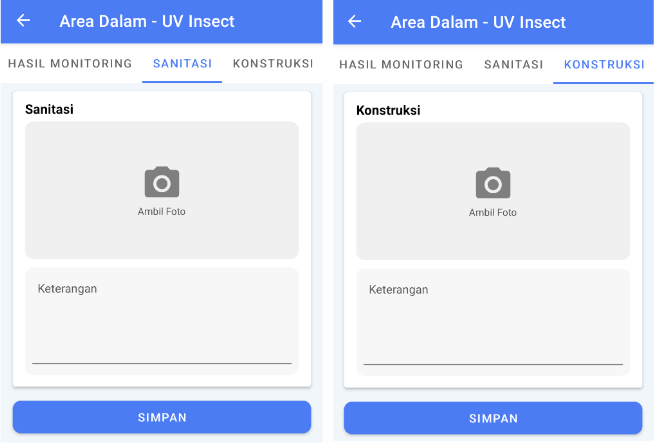  
   1. Klik kolom `SANITASI`
   2. Klik `📷 Ambil Foto`
   3. Isi keterangan sanitasi
   4. Klik `SIMPAN`
  </TabItem>
  <TabItem value="konstruksi" label="Konstruksi">
  :::info
  Jika ada tindakan area atau tindakan perangkap maka wajib diisi. Namun, jika tidak ada tindakan area atau tindakan perangkap maka opsional tidak diisi.
  :::
     
   1. Klik kolom `KONSTRUKSI`
   2. Klik `📷 Ambil Foto`
   3. Isi keterangan konstruksi
   4. Klik `SIMPAN`
  </TabItem>
</Tabs>

