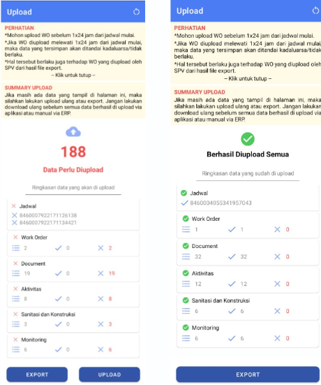

:::info
Export terdiri dari dua:
1. Sebelum upload
2. Setelah upload

Export setelah upload, adalah metode alternatif terakhir apabila semua mode upload mengalami kendala dan masih ada data pekerjaan yang belum terupload
:::
  
1. Klik `Upload`
2. Tombol export akan tampil pada halaman summary upload sebelum dan sesudah upload
3. Klik `Export`
4. File hasil export ada pada folder /storage/Downloads/ETL-Standby-v3/ ETL-Standby-v3 -12345.xlsx
5. Kirim file tersebut ke SPV
6. Selanjutnya SPV yang melakukan upload manual