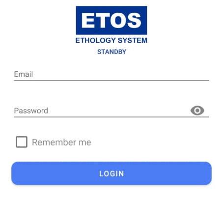
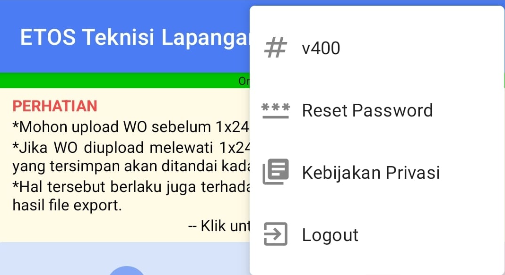

---
### Login
1. Buka aplikasi ETL Standby di perangkat Android.
2. Masukkan `Email` dan `Password`

3. Tekan tombol `Login`
4. Setelah berhasil login, Anda akan diarahkan ke halaman utama aplikasi yang mungkin menampilkan daftar pekerjaan atau informasi lainnya

:::note
Bagi operator yang belum memiliki akun, silahkan koordinasi dengan SPV untuk minta didaftarkan ke bagian HR (Human Resources)
:::

### Setelan

* `# v400`: Menampilkan informasi versi aplikasi, yaitu v400.
* `\*\*\* Reset Password`: Opsi untuk mengatur ulang kata sandi akun pengguna.
* `Kebijakan Privasi`: Mengarahkan pengguna ke halaman yang berisi informasi mengenai kebijakan privasi aplikasi. Ikon di sebelah kiri teks berupa gambar buku terbuka atau dokumen.
* `Logout`: Opsi untuk keluar dari akun pengguna saat ini. Ikon di sebelah kiri teks berupa panah mengarah ke kanan keluar dari sebuah kotak.

