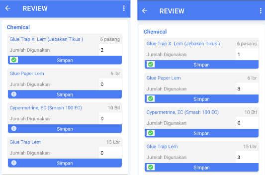
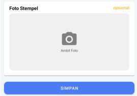
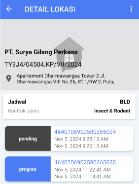

:::info
Setelah melakukan checkout,selanjutnya akan tampil halaman review. Pada halaman ini akan ditampilkan detail pekerjaan, data checkin dan checkout, serta operator perlu melakukan isi data chemical yang telah digunakan. Jika memang chemical tidak digunakan, silahkan isi 0.
:::

  
1. Isi jumlah yang digunakan
2. Klik `SIMPAN`
3. Pastikan semua data checmical sudah bertanda checklist
4. Minta pelanggan untuk tanda tangan dengan cara `Klik disini untuk tanda tangan`
5. Jika ada stempel, silahkan foto stempel. Jika tidak ada, foto tidak perlu ditambahkan
   
6. Klik `SIMPAN`
7. Pekerjaan yang telah checkout akan berstatus pending
