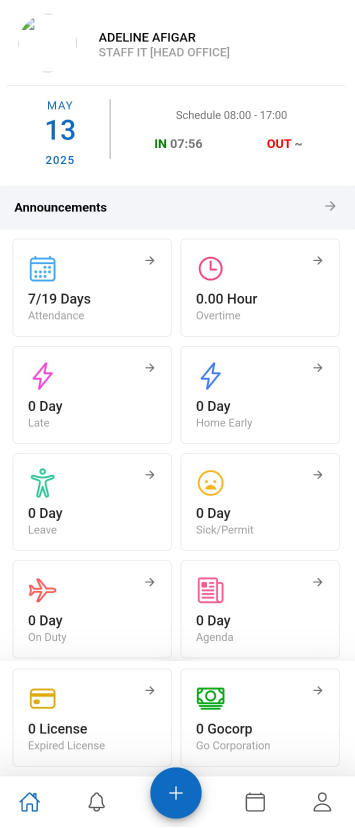

Setelah login, pengguna akan diarahkan ke halaman **dashboard** yang menjadi pusat informasi aktivitas kehadiran dan administratif personal. Dashboard ini dirancang agar pengguna dapat melihat ringkasan status kerja harian dan pengajuan dengan cepat dan mudah.

#### Elemen yang Tersedia di Dashboard:

- **Informasi Profil**  
  Menampilkan nama pengguna, jabatan, jadwal kerja harian, serta status check-in dan check-out.

- **Pengumuman (Announcements)**  
  Area khusus untuk menyampaikan informasi atau pemberitahuan penting dari perusahaan atau HR.

- **Ringkasan Kehadiran & Aktivitas**  
    | Aktivitas                 | Keterangan                            |
    |---------------------------|---------------------------------------|
    | Attendance                | Jumlah hari hadir dari total kerja    |
    | Overtime                  | Lembur yang tercatat                  |
    | Late                      | Jumlah hari terlambat                 |
    | Home Early                | Jumlah hari pulang lebih awal         |
    | Leave                     | Jumlah hari cuti yang diambil         |
    | Sick/Permit               | Jumlah hari sakit atau izin resmi     |
    | On Duty                   | Jumlah perjalanan dinas               |
    | Agenda                    | Jumlah agenda kerja                   |
    | Expired License           | Lisensi atau dokumen kadaluarsa       |
    | Go Corporation (GoCorp)   | Jumlah perjalanan dinas via GoCorp    |

- **Navigasi Bawah**  
  Tersedia menu navigasi cepat untuk mengakses halaman utama, notifikasi, pengajuan, kalender, dan profil pengguna.
