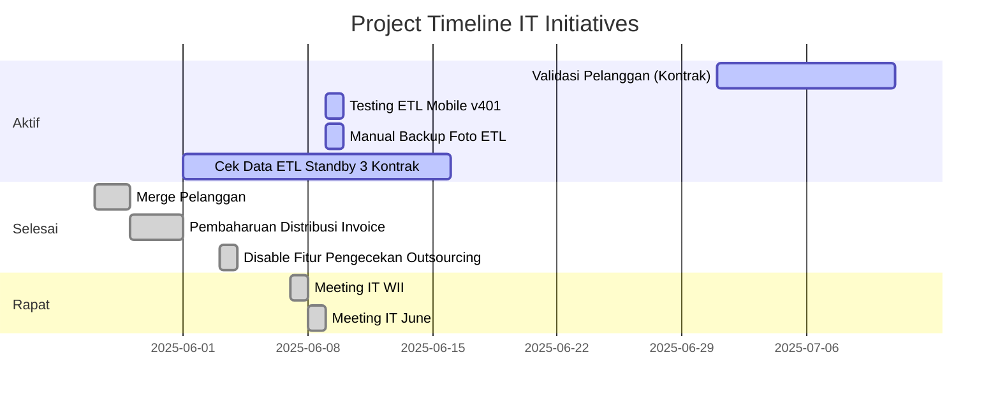

Berikut adalah status dan jadwal proyek IT yang sedang berjalan atau akan dimulai.

### Gantt Chart View

### Detail Tasks

| Project Name              | Phase      | Status      | Start Date | End Date   | Assigned To... | Platform    | Notes                                  |
| :------------------------ | :--------- | :---------- | :--------- | :--------- | :------------- | :---------- | :------------------------------------- |
| WIO Standby               | Development | In Progress | May 15, 2025 |            | Arifin         | erp-v2      |                                        |
| Cek Data ETL Standby 3 Kontrak | Review     | In Progress | June 1, 2025 | June 15, 2025 | Adel, Hexa     | etl-standby |                                        |
| Testing ETL Mobile v401   | Testing    | In Progress | June 9, 2025 | June 9, 2025 | Bham           | etl-mobile  |                                        |
| Manual Backup Foto ETL    | Review     | In Progress | June 9, 2025 | June 9, 2025 | Bham           | etl-standby |                                        |
| Validasi Pelanggan (Kontrak) | Development | In Progress | July 1, 2025 |            | Arifin         | erp-v2      |                                        |
| Migrasi Database X        | Development | In Progress | 2025-07-01 | 2025-07-15 | Tim DB         | Backend     | Perlu koordinasi dengan Tim Dev.       |
| Pengembangan Modul Y      | Development | Not Started | 2025-07-05 | 2025-08-01 | Tim Dev        | ERP-V2      | Menunggu finalisasi spesifikasi.       |
| Implementasi API Z        | Integration | Completed   | 2025-07-10 | 2025-07-25 | Tim Integrasi  | External API | Sudah diuji di staging.                |