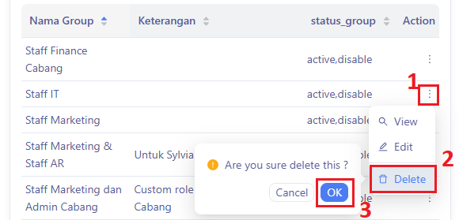

Panduan ini menjelaskan bagimana dapat mengelola grup pengguna dalam sistem, termasuk menambahkan grup baru, melihat detail grup, mengedit informasi grup, dan mengatur hak akses (permissions) untuk setiap modul aplikasi.

### Akses Menu Group

1. Klik `Module`
2. Klik `⚙ User & Role`
3. Pilih menu `Groups`.

### Melihat Daftar Group

Tampilan akan menampilkan daftar group yang tersedia dengan kolom:
- **Nama Group**: Nama dari role/group user (misal: COO, AR Staff).
- **Keterangan**: Deskripsi atau jabatan group tersebut.
- **Status Group**: Status aktif atau disable.
- **Action**: Tombol aksi (View, Edit, Delete).

---

### Menambahkan Group Baru

1. Klik `+ Add New`
2. Akan muncul form dengan input berikut:
   - **Nama**: Masukkan nama grup (misal: HRD Manager).
   - **Keterangan**: Masukkan deskripsi grup.
3. Klik tombol `OK` untuk menyimpan atau `Cancel` untuk membatalkan.

---

### Melihat Detail & Hak Akses Group

1. Klik titik tiga pada Action
2. Klik `View` 

3. Akan muncul tampilan detail group yang berisi:
   - Daftar modul (ERP, Absensi, Akutansi, dll) di sisi kiri.
   - Setiap modul memiliki entitas (seperti Acara, Departemen, Divisi, dll).
   - Masing-masing entitas memiliki pilihan hak akses:
     - `add > (crud)` – menambah data
     - `edit > (crud)` – mengubah data
     - `delete > (crud)` – menghapus data
     - `detail > (crud)` – melihat detail
     - `confirm > (data_flow)` – mengonfirmasi alur data
     - `draft > (data_flow)` – menyimpan draft data
3. Gunakan opsi **Check All** untuk memberikan semua akses sekaligus pada entitas terkait.

### Mengedit Group

1. Klik titik tiga pada Action
2. Klik `Edit` 

3. Ubah informasi nama, keterangan, atau hak akses sesuai kebutuhan.
4. Klik tombol `OK` untuk menyimpan atau `Cancel` untuk membatalkan.

### Menghapus Group

1. Klik titik tiga pada Action
2. Klik `Delete`
3. Akan muncul konfirmasi, klik `OK` jika yakin ingin menghapus atau `Cancel` untuk membatalkan.

---

:::tip
- Gunakan nama group yang konsisten dan jelas agar mudah dipahami user lain.
- Lakukan pengecekan hak akses secara berkala untuk menjaga keamanan data.
:::