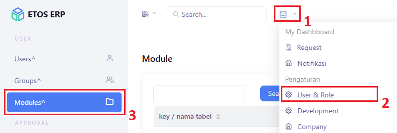
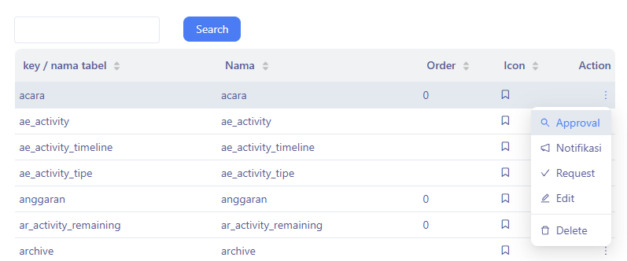
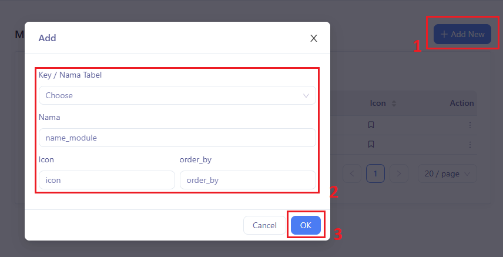
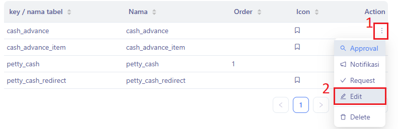
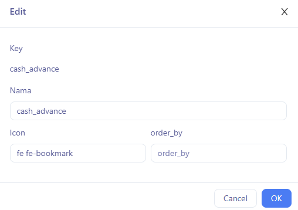
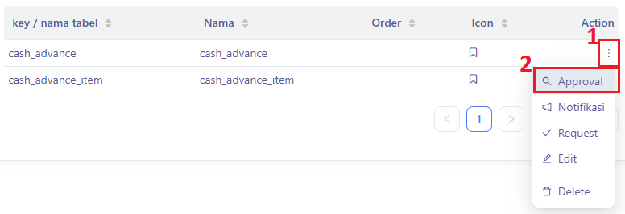
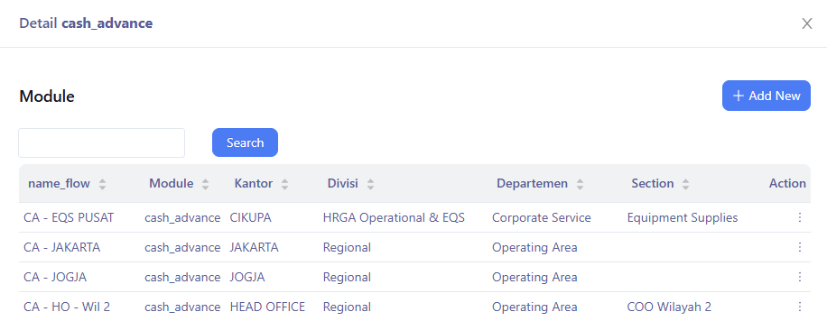
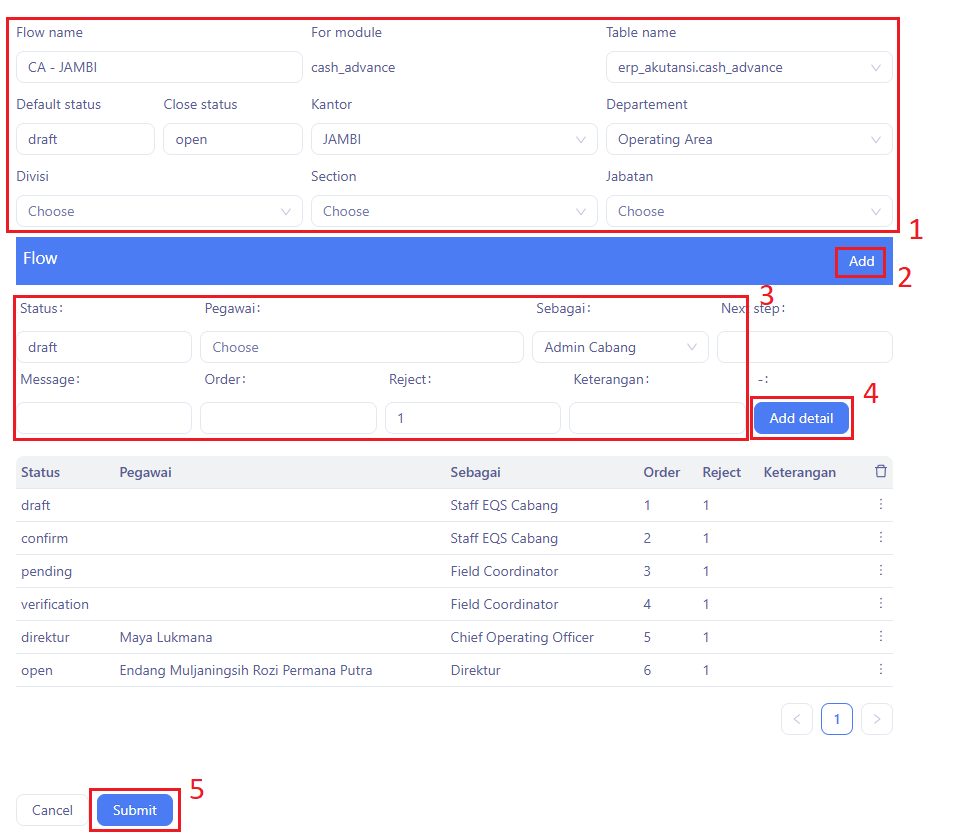

Panduan ini menjelaskan bagimana dapat mengelola hak approval berdasarkan Key / Nama Tabel.

### Akses Menu Module

1. Klik `Module`
2. Klik `⚙ User & Role`
3. Pilih menu `Module`.

### Melihat Daftar Key / Nama Tabel

Tampilan akan menampilkan daftar key / nama tabel yang tersedia dengan kolom:
- **Key / Nama Tabel** : Nama kunci atau nama tabel database yang terkait dengan modul.
- **Nama**: Nama module
- **Order**: Urutan module (biasanya angka).
- **Icon**: Ikon visual yang diasosiasikan dengan modul.
- **Action**: Tombol aksi yang tersedia untuk setiap baris modul.

### Menambahkan Key / Nama Tabel Baru

1. Klik `+ Add New`
2. Akan muncul form dengan input berikut:
    - **Pegawai** 
   - **Name**
   - **Group**
   - **Email**  

3. Klik tombol `Submit` untuk menyimpan atau `OK` untuk membatalkan.

### Mengedit Key / Nama Tabel

1. Klik titik tiga pada Action
2. Klik `Edit` 

3. Ubah informasi Nama, Icon, order_by
4. Klik tombol `OK` untuk menyimpan atau `Cancel` untuk membatalkan. 

### Konfigurasi Alur Kerja Approval
1. Klik titik tiga pada Action
2. Klik `Approval` 

#### Menambahkan Data Flow
1. Klik `+Add New`

2. Lengkapi form data flow
3. Klik `Add`
4. Lengkapi flow
5. Klik `Add Detail`
6. Ulangi langkah 3-5 hingga semua status lengkap
7. Klik `Submit`
