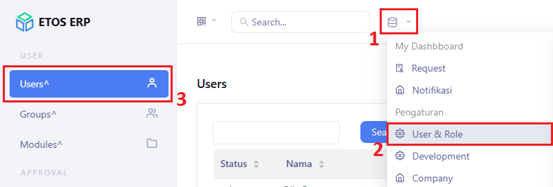
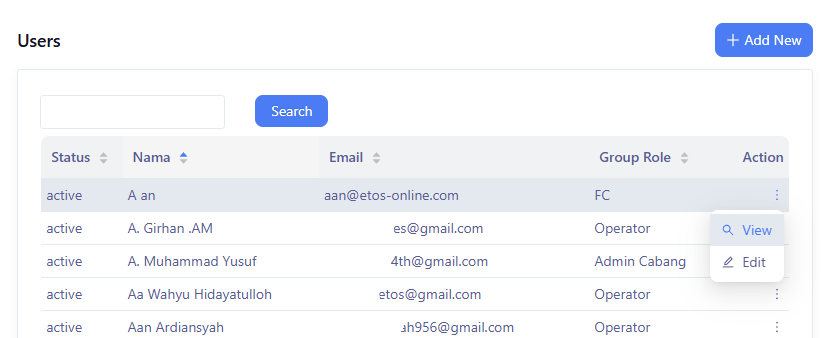
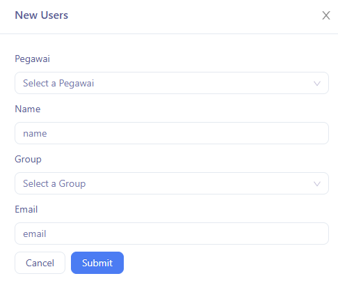
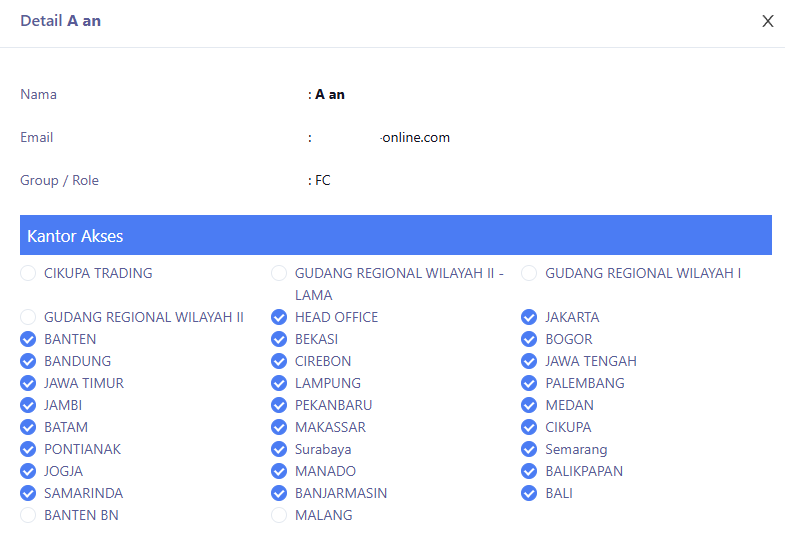
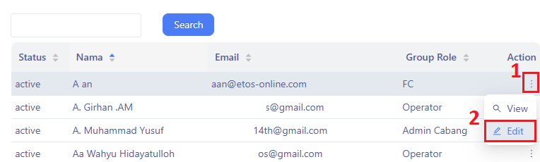

Panduan ini menjelaskan bagimana dapat mengelola hak akses user dalam sistem, termasuk menambahkan user baru, melihat detail user, mengedit informasi user, dan mengatur hak akses (permissions) berdasarkan grup dan kantor.

### Akses Menu User

1. Klik `Module`
2. Klik `⚙ User & Role`
3. Pilih menu `Users`.

### Melihat Daftar User

Tampilan akan menampilkan daftar user yang tersedia dengan kolom:
- **Status** : Status akun user (active/non-active)
- **Nama**: Nama user
- **Email**: Email user tersebut.
- **Group Role**: Group user tersebut
- **Action**: Tombol aksi (View, Edit, Delete).

### Menambahkan User Baru

1. Klik `+ Add New`
2. Akan muncul form dengan input berikut:
    - **Pegawai** 
   - **Name**
   - **Group**
   - **Email**
3. Klik tombol `Submit` untuk menyimpan atau `OK` untuk membatalkan.

### Melihat Detail & Kantor Akses User

1. Klik titik tiga pada Action
2. Klik `View` 

3. Ceklis (✔) pada kantor yang dipilih sebagai akses user

### Mengedit user

1. Klik titik tiga pada Action
2. Klik `Edit` 

3. Ubah informasi nama, keterangan, atau group akses sesuai kebutuhan.
4. Klik tombol `OK` untuk menyimpan atau `Cancel` untuk membatalkan.

:::tip
- Gunakan nama user yang konsisten dan jelas agar mudah dipahami user lain.
- Lakukan pengecekan hak akses secara berkala untuk menjaga keamanan data.
:::