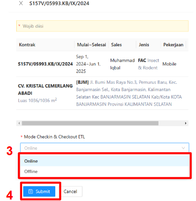

:::info
- Checkin online akan menjadi default untuk semua lokasi, namun konfigurasi checkin/checkout dapat disesuaikan (online/offline) di lokasi kerja masing-masing
- Apabila checkin/checkout dikonfigurasi secara offline, untuk proses upload/export yang dilakukan operator tetap dilakukan secara online.

Pengaturan ini dapat disesuaikan oleh pengguna melalui langkah berikut:
:::
1. Hover pada kontrak yang dipilih
2. Klik aksi `ETL Checkin/Checkout Mode`

    

3. Pilih Mode Checkin & Checkout
4. Klik `Submit`

