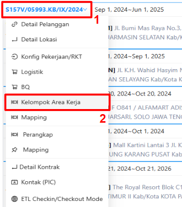
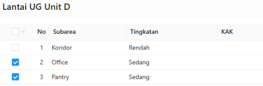
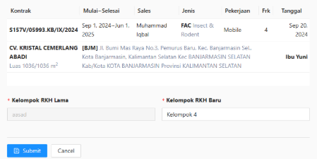
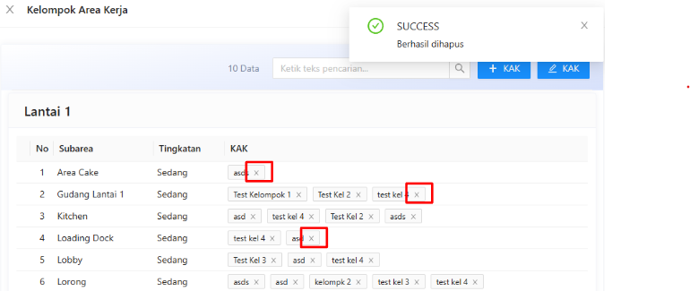
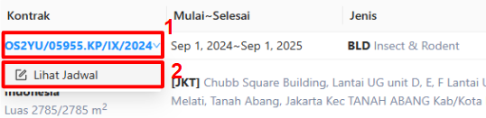
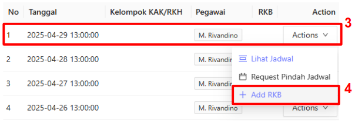
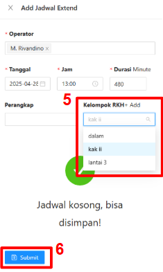

:::info
- Pastikan lokasi yang memiliki Kelompok Area Kerja Harian (KAK-H) sudah di setup saat pembuatan RKB
- Apabila setup KAK tidak dilakukan atau dipilih saat pembuatan RKB. Maka, semua area wajib diisi
- Untuk lokasi dengan sinyal yang sulit atau jauh, pastikan sudah dikonfigurasi untuk mode check-in offline agar tetap dapat beroperasi dengan baik
:::
### Membuat KAK
1. Hover pada nomor kontrak yang dipilih
2. Klik `Kelompok Area Kerja` 
   
3. Klik `+ KAK`
4. Isi nama KAK
5. Ceklis pada subarea terpilih
   
6. Klik `Simpan`

### Mengubah Nama KAK
1. Hover pada nomor kontrak yang dipilih
2. Klik `Kelompok Area Kerja`
3. Klik `🖊 KAK`
4. Pilih nama KAK yang akan diubah
5. Input nama KAK baru
6. Klik `Submit` 
   

### Menghapus KAK
1. Hover pada nomor kontrak yang dipilih
2. Klik `Kelompok Area Kerja`
3. Klik `X` pada KAK 
   

### Setup KAK pada RKB
1. Hover pada nomor kontrak yang dipilih
2. Klik `Lihat Jadwal` 
   
3. Klik `Actions` pada jadwal yang dipilih
4. Klik `+ Add RKB` 
   
5. Isi field tanggal, jam, durasi, dan perangkap
6. Pilh kelompok RKH 
   
7. Klik `Submit`