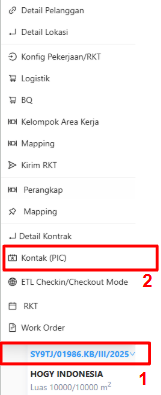
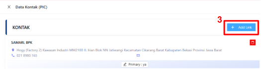
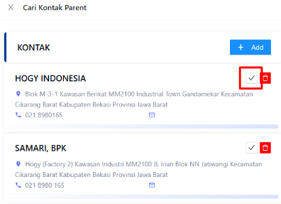
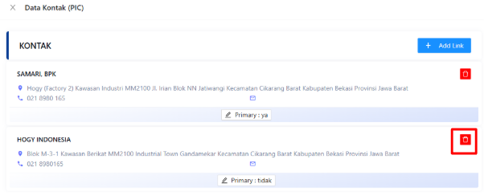

:::info
- Data kontak telah dimigrasikan dari tabel lokasi (PIC Lama) ke Kontak Baru (Multiple PIC)
- Untuk menghindari kegagalan migrasi, jika suatu PIC tidak ikut pindah, sistem tetap akan menggunakan data PIC lama saat pengiriman WO Digital.
- Untuk kontrak baru (dari penawaran) sistem kini mewajibkan memilih kontak sebagai primary
- Multiple PIC untuk penawaran dapat ditambahkan saat transfer kontrak
:::

### Multiple Kontak
1. Hover pada kontrak yang dipilih
2. Klik Kontak (PIC)

   

3. Klik +Add Link untuk menambahkan Kontak PIC

   
4. Klik `☑` pada kontak yang dipilih

   

### Konfigurasi Primary Multiple Kontak
1. Hover pada kontrak yang dipilih
2. Klik Kontak (PIC)
3. Klik `Primary` pada kontak
4. Klik `OK`

### Menghapus kontak
1. Hover pada kontrak yang dipilih
2. Klik Kontak (PIC)
3. Klik `🗑`

