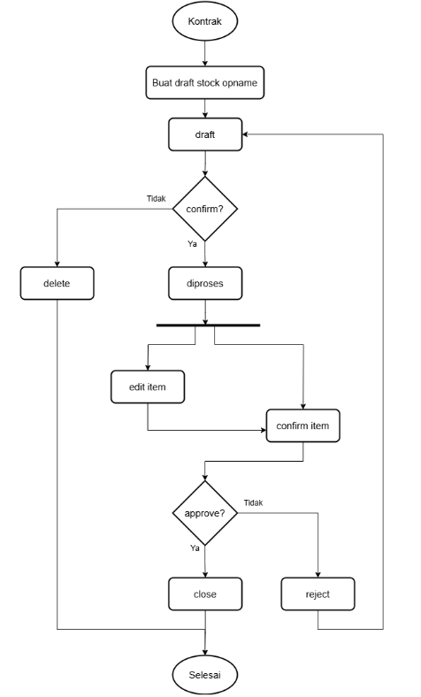
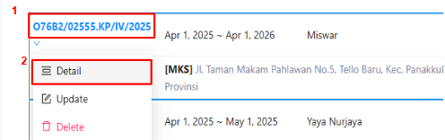
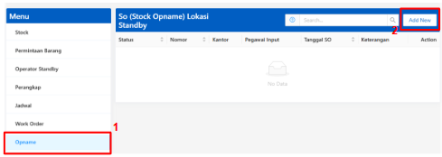
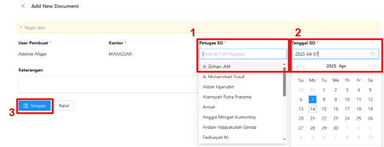
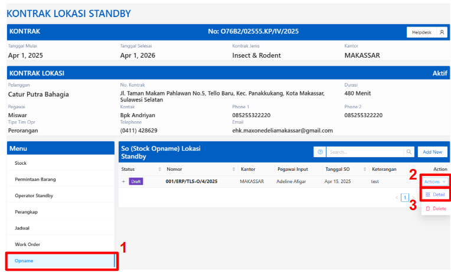
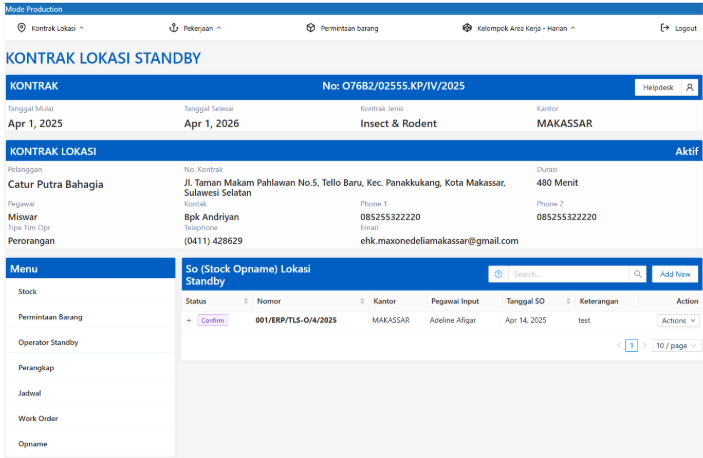
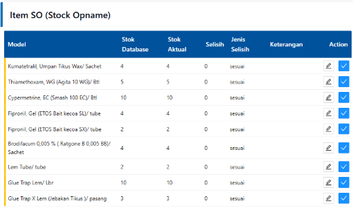
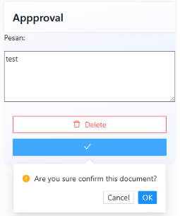
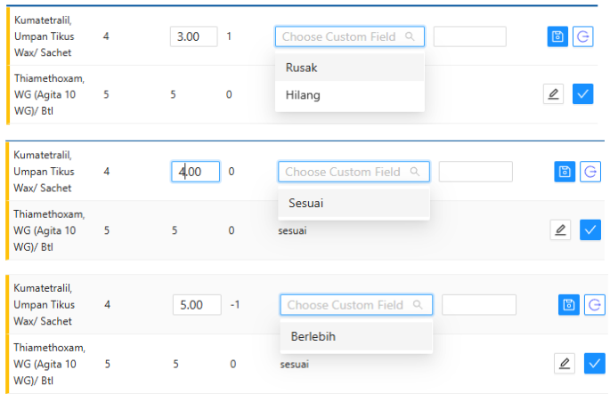

### Definisi

Hal yang Perlu Diperhatikan:
1. Supervisor Operational membuat data stock opname pada kontrak yang dipilih
2. Stok aktual dapat disesuaikan dan dikonfirmasi oleh Supervisor Operational pada tahap konfirm
3. Selama belum konfirmasi (klik checklist) pada setiap model stok, maka stok aktual setiap model masih dapat disesuaikan/diubah
4. Manager Operational melakukan approval pada stock opname yang sesuai dan status akan menjadi close
5. Stock opname yang di-reject oleh Manager Operational statusnya akan menjadi draft
6. Delete stock opname hanya bisa dilakukan apabila statusnya draft

| Status               | Di-approve oleh         |
|----------------------|-------------------------|
| Draft                | Supervisor Operational  |
| Confirm              | Supervisor Operational  |
| Diproses             | Supervisor Operational  |
| Close                | Manager Operational     |

### Draft
1. Pada menu Kontrak Lokasi, Klik `Standby` atau akses https://app.etos.app/kontrak-lokasi/standby/list
2. Hover no. kontrak
3. Klik `Detail`  
   
4. Klik `Opname`
5. Klik `Add New` 
   
1. Isi form  

:::note
Add item hanya bisa jika status sudah confirm
:::

### Confirm
1. Klik `Detail` pada no. kontrak
3. Klik `Opname`
4. Klik `Detail` 
   
5. Klik `✔`
6. Klik `OK`
7. Tampilan Confirm 
   

### Diproses
1. Klik `Detail` pada no. kontrak
3. Klik `Opname`
4. Klik `Detail` 
   
5. Klik `🖊` apabila stok database dan stok aktual tidak sesuai
6. Klik `✔` apabila stok database dan stok aktual sudah sesuai
Selama belum konfirmasi (klik checklist) pada setiap model, maka stok aktual setiap model masih dapat disesuaikan/diubah  
   
7. Setelah setiap item sudah di-approve. Klik `✔`  
   

#### Edit Item
1. Setelah klik `🖊` pada Action, maka akan tampil seperti gambar di bawah ini
2. Sesuaikan stok aktual, maka nilai selisih akan menyesuaikan (stok database - stok aktual)
3. Sesuaikan jenis selisih; berlebih/sesuai/rusak/hilang
4. Isi keterangan apabila tidak sesuai stok database
5. Klik `💾` 
6. Selama belum konfirmasi (klik `✔`) pada model, maka model masih dapat disesuaikan/diubah

#### Jenis Selisih

- <strong>Stok aktual < stok database</strong>    ➡ jenis selisih: Rusak/hilang
- <strong>Stok aktual == stok database</strong>   ➡ jenis selisih: Sesuai
- <strong>Stok aktual > stok database</strong>    ➡ jenis selisih: Berlebih

### Close
1. Klik `Detail` pada no. kontrak
3. Klik `Opname`
4. Klik `Detail` 
   
5. Klik `✔` untuk approve
6. Klik `✖` untuk reject

:::note
Item Stock Opname yang di-Reject oleh Manager Operational akan berstatus draft
:::