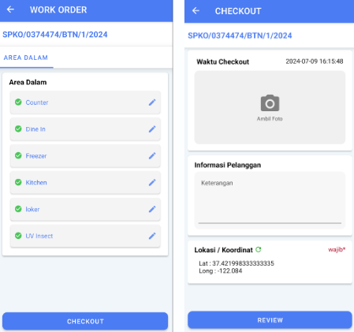

:::info
* Mode online
* Minimal 5 area kerja harus bertanda checklist
* Minimal 30 menit durasi kerja (interval waktu checkin dan checkout)
* Harus dilakukan pada saat sebelum meminta tandatangan pelanggan
:::

  
1. Klik `CHECKOUT`
2. Klik `📷 Ambil Foto`
3. Isi informasi pelanggan dan koordinat pada halaman checkout
4. Klik `REVIEW`
