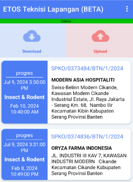

  
:::info
* Sistem membatasi maksimal hanya 5 jadwal per 1x download. Tujuan dibatas 5 jadwal dalam sekali download agar tidak berat saat download.
* Jadwal yang bisa dikerjakan adalah yang berstatus progres
* Urutan jadwal yang tampil adalah berdasarkan waktu mulai terdekat, bukan jarak antara pelanggan satu dan lainnya.

Contoh:
    Ada 10 jadwal progres, kemudian download pekerjaan dan akan tampil 5 jadwal dengan waktu terkini. Bagaimana mengerjakan sisa 5 jadwal yang tidak tampil?
    1. Kerjakan dulu jadwal yang ada
    2. Upload jadwal yang sudah dikerjakan
    3. Download ulang jadwal, maka sisa jadwal progres akan tampil
:::
1. Jika tampil notifikasi _Tidak ada lokasi!_ pada tampilan home, maka operator perlu download SPKO 
2. Download harus dilakukan mode online dengan jaringan data/wifi yang stabil
3. Klik tombol `Download` untuk menampilkan lokasi kerja

:::note
Untuk jadwal yg diupload adalah yg berstatus pending, jadi jika sudah ada 1 jadwal status pending bisa langsung diupload, atau juga bisa menunggu jadwal selesai semua lalu diupload. semua tergantung user.
:::
---

#### 📤 Upload