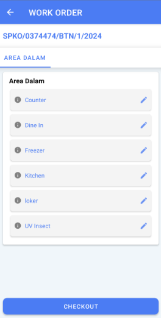

1. Induk area diklik sebagai pengganti scroll (atas/bawah)
2. Klik pada subarea (contoh: Kitchen) untuk pindah ke halaman Work Order
3. Isi minimal 5 sub area untuk bisa checkout (5 sub area terchecklist hijau)
4. Sub area dengan tanda checklist hijau artinya sudah lengkap terisi

:::note
* Abaikan tombol checkout jika work order belum selesai diisi
* Apabila area kerja tidak sesuai dengan yang ada di lapangan harap infokan SPV, selanjutnya SPV harus infokan AE supaya area kerja dapat disesuaikan.
* Dalam periode SPKO pertama dan yang akan datang, apabila area kerja belum sesuai, SPV harus infokan AE supaya di SPKO mendatang area kerja sudah sesuai.
:::

