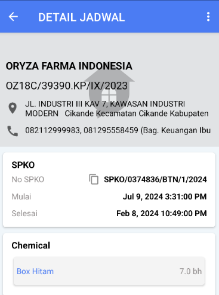
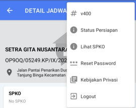
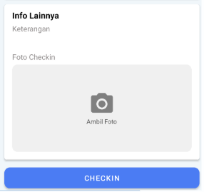

:::info 
Secara default checkin dilakukan secara online, namun mode checkin/checkout dapat diubah menjadi offline di ERP
:::
:::warning
cek kelengkapan dan detail jadwal sebum checkin
:::

### Detail Jadwal

1. Klik nomor jadwal untuk melihat detail jadwal dan melakukan checkin
2. Pada detail jadwal, klik icon PDF untuk membuka SPKO (legalitas kerja)
3. Pada detail Jadwal, klik no telpon untuk melakukan panggilan pada pelanggan
4. Pada detail Jadwal, klik alamat untuk membuka maps direction (apabila alamat tidak sesuai dengan google maps maka fungsi ini tidak efektif)
5. Pada detail Jadwal, klik nomor Jadwal untuk copy nomor SPKO.

### Setelan Jadwal

1. Pada detail jadwal, klik tanda titik 3 di pojok kanan atas
2. Pada setelan jadwal, klik `Status Persiapan` untuk melihat apakah data sudah sesuai
3. Pada setelan jadwal, klik Lihat SPKO yang nanti bisa ditunjukkan ke pihak security pelanggan atau PIC pelanggan apabila dibutuhkan

:::warning
Pastikan chemical, alat & tools sesuai, apabila tidak sesuai mohon infokan SPV sebelum checkin
:::

### Check-in

1. Klik `📷 Ambil Foto`
2. Ambil foto selfie sesuai standar
3. Klik `OK`, kemudian klik tombol `CHECKIN`
