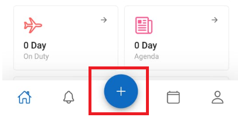
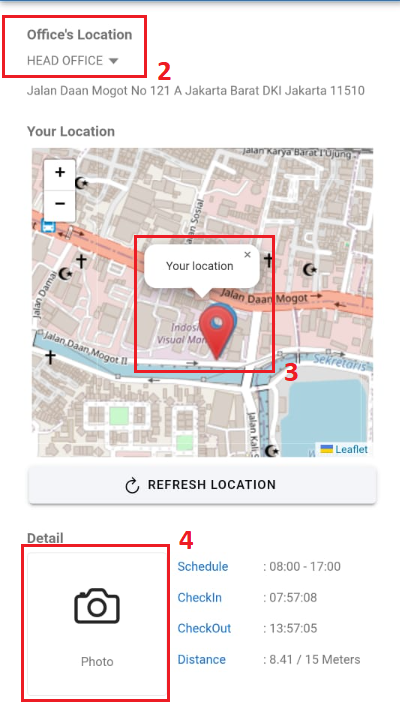

:::info
- Jarak ketentuan titik koordinat kantor yaitu kurang dari 10 meter
- Kondisi pegawai boleh checkin di luar jarak ketentuan yaitu:
    - Kunjungan ke Cabang
    - Kunjungan ke Pelanggan
    - Work From Home
    - Meeting di luar kantor
    - Lainnya
:::

1. Klik `+`  

2. Pastikan lokasi kantor sesuai  
3. Pastikan titik kordinat sesuai  
4. Ambil foto 
5. 
6. Klik `Checkin`  
   
---