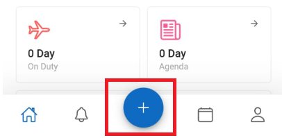

1. Klik `+`  

2. Pastikan lokasi kantor sesuai  
3. Pastikan titik kordinat sesuai  
4. Ambil foto 
5. Klik `Checkin`  
   

:::tip
- Klik `Refresh Location` jika titik lokasi belum sesuai
- Foto selfie dengan wajah terlihat jelas diperlukan sebagai bukti kehadiran saat melakukan Check-In.
- Pastikan foto diambil di dekat kantor atau area kerja, dengan latar belakang yang menunjukkan bahwa pegawai benar-benar berada di lokasi tersebut.
- Aktifkan GPS/Lokasi pada perangkat dan berikan izin akses lokasi untuk aplikasi ETOS STARS agar sistem dapat mencatat posisi check-in dengan akurat.
- Jarak ketentuan titik koordinat kantor yaitu kurang dari 10 meter
:::
---