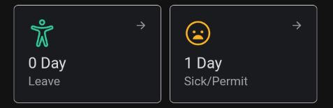
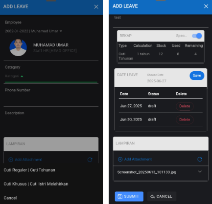
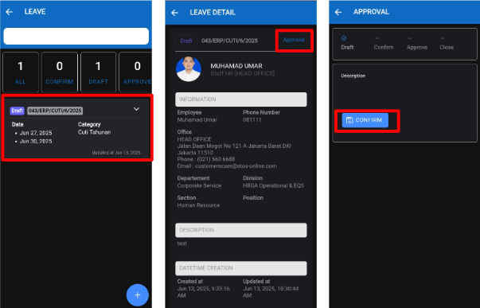

Panduan ini menjelaskan langkah-langkah untuk mengajukan cuti melalui aplikasi ETOS STARS.

### 1. Masuk ke Menu Leave

1. Pada halaman utama, klik kotak bertuliskan `"0 Day Leave"`.
2. Di halaman Leave, klik tombol `"+"` di pojok kanan bawah.

    

### 2. Isi Formulir Pengajuan Cuti

1. Pilih jenis cuti dan tanggal cuti yang diinginkan.
2. Masukkan informasi seperti kategori cuti, nomor telepon, dan deskripsi (jika perlu).
3. Tambahkan lampiran jika diperlukan (contoh: surat dokter).
4. Klik tombol `Submit` untuk mengajukan cuti.

### 3. Konfirmasi dan Tunggu Approval

1. Setelah cuti diajukan, statusnya akan muncul sebagai `Draft`.
2. Klik pada data cuti tersebut untuk melihat detailnya.
3. Klik tombol `Approval`.
4. Lanjutkan dengan klik `Confirm` untuk mengirim pengajuan ke atasan.

### ✅ Selesai

Tunggu proses approval dari atasan atau HR. Anda dapat memantau status cuti pada halaman `Leave`. Jika Anda mengalami kendala, silakan hubungi tim HR
