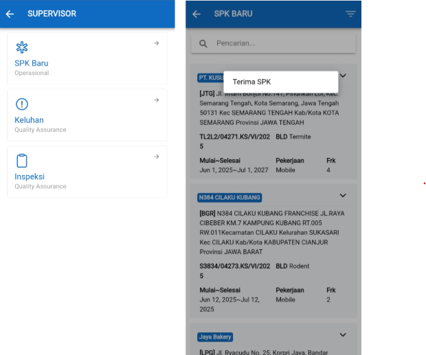

Panduan ini menjelaskan langkah-langkah untuk supervisor melakukan follow up keluhan dan inspeksi, hingga terima SPK melalui aplikasi ETOS STARS.

### 1. Login ke Aplikasi ETOS STARS

1. Buka aplikasi ETOS STARS.
2. Masukkan `email` dan `password` Anda.
3. Klik tombol `Login`.

    

### 2. Terima SPK
1. Pada halaman supervisor, klik `"SPK BARU`.
2. Pilih nomor kontrak
3. Klik `v`
4. Klik Terima SPK
5. Isi Form
6. Klik Submit

    

### 3. Keluhan (Complain)
1. Klik `Keluhan`
2. Cari komplain
3. Klik `Follow Up`
4. Isi Form
5. Klik `Req Verification`

### 4. Inspeksi
1. Klik `Inspeksi`
2. Cari nomor kontrak
3. Baca detail dari inspeksi
4. Klik `Follow Up`
5. Isi Form
5. Klik `Req Verification`